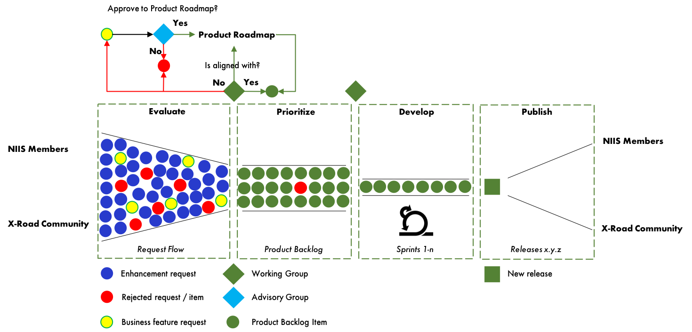

# X-Road Development Model

#### VERSION CONTROL
| version no.	 | what has been done	| date/person
| ---- | ---- | ---- |
| 0.1	| Initial draft.	| 18.3.18 / PK

The purpose of this document is to describe the change management process of the X-Road software. The process
must ensure the quality of the source code, the application of best practices and the ability to manage software
changes to be applied to local production environments. The process is controlled by the Nordic Institute for Interoperability Solutions (NIIS).

Non-Functional Requirements are described in the [X-Road Non-Functional Requirements](NFR.md) document. The workflow policy based on this document is described in the [Workflow Policy](WORKFLOW.md) document.

## 1 Roles and Responsibilities

The change management process includes the following roles and responsibilities:

* NIIS
  * Maintains product roadmap and product backlog
  * Maintains the master source code repository
  * Maintains Non Functional Requirements
  * Reviews and accepts / rejects contributions
  * Organizes and facilitates Advisory Group and Working Group meetings
  * Schedules releases
  * Coordinates daily work
* NIIS Member
  * Nominates representatives to the Advisory Group
  * Participates in the Working Group
  * Submits business feature and enhancement requests
  * Submits code contributions including required documentation
* Advisory Group  
  * Accepts / rejects business feature requests
  * Prioritizes product backlog
* Working Group
  * Prioritizes product backlog
  * Accepts / rejects enhancement requests
* X-Road Community
  * Submits business feature and enhancement requests
  * Submits code contributions including required documentation

## 2 Change Management

Diagram 1. Change management.

The Product Roadmap is a plan that outlines the flow of new business features
needed to satisfy the needs of the NIIS members. The roadmap helps reach a
consensus about future developments and it provides a framework to help plan
and coordinate upcoming releases. The X-Road roadmap takes into consideration
scoped functionality and X-Road production compatibility. Changes to the Product
Roadmap are approved by the Advisory Board.

The Product Backlog contains fine grained technical items derived from the
Product Roadmap items and enhancement requests. The Product Backlog is prioritized
by the Advisory Group and Working Group.

X-Road Product Roadmap and Product Backlog are owned and managed by the NIIS.

### 2.1 Scoping Process
The determination of what development is in scope of a X-Road Release is determined by the Steering Committee
through a scoping process (diagram 1). Inputs to this process are provided by X-Road development partners.

##### 2.1.1 Core System
All the changes to the X-Road core must be approved by the Steering Committee. Adding a new core item to the roadmap
is done by submitting a formal enhancement proposal that includes functional and technical description of the item.
The technical description must contain a description of the architectural changes required by the item and a plan
for the implementation. The Steering Committee accepts or rejects the proposal. Accepted proposals are added to
the roadmap. Rejected proposals can be resubmitted after modification.

Alternatively, a new enhancement proposal can be submitted without the technical de-scription, and get accepted
to the roadmap. However, the technical description must be submitted, and accepted by the Steering Committee prior to the implementation.

##### 2.1.2 Extensions
All the extensions must be notified to the Steering Committee by submitting a formal ex-tension notice. The notice
must include a functional description of the extension. Adding a technical description of the extension to notice is highly recommended, but not mandatory. The Steering Committee adds the extension to the roadmap.

### 2.2 Security Bug Fixes
All issues on critical updates shall be brought to the Steering Committee. The Steering Committee agrees how the
security issue is fixed and which partner produces the patch.

## 3 Warranty
When an error is detected, the Partner who located the error is responsible of detecting the source of the error. Detecting the source of the error means tracking the first version of the software that contains the error. When the source is detected the Partner who created the version in question must be notified. The Partner who created the version is responsible of fixing the problem.

## 4 Release Sequence
The determination of what sequence a release will be identified with will be determined by the X-Road Steering Committee.
A basic software rule of thumb will be as follows.
*	Major Release (X.0) will be used for significant jumps in functionality such as changing the framework which could
cause incompatibility with interfacing systems or new modules/components.
*	Minor Release (X.X) will be used when only minor features or significant fixes have been added.
*	Revision Release (X.X.X) is used and incremented when minor bugs are fixed.

At times the release sequence may jump multiple minor versions at a time to indicate sig-nificant features have been
added, but are not enough to warrant incrementing a major version number.
See Non Functional Requirements [X-Road Non-Functional Requirements] document for more detailed information on version
numbering.

To distinguish vendor-specific work, vendors can label its products by attaching vendor suffix and vendor version number to X-Road semantic version number (mailnly in 'develop' branch). Example: `6.8.0.Qwerty.3` denotes software developed by Qwerty Corporation, version 3.

## 5 Version Compatibility
Major versions of X-Road are intended to be longlived versions of the software which consist of numerous minor versions.
The decision to create a new major version of X-Road will be the result of the need for major changes which cannot be
successfully implemented without breaking version compatibility.

#### References
- [X-Road Non-Functional Requirements] X-Road Non-Functional Requirements.
- [Workflow Policy] Workflow Policy, https://github.com/e-gov/Open-Workflow/blob/master/WORKFLOW.md.
